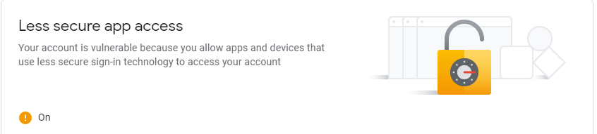
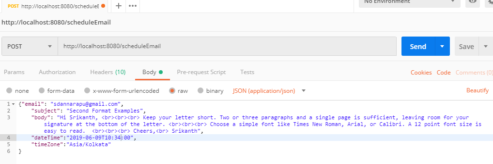
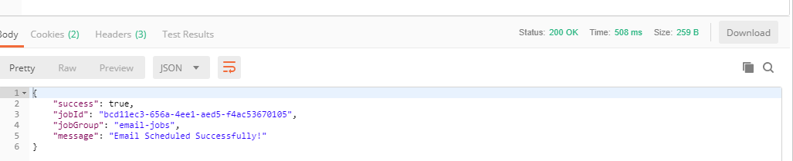
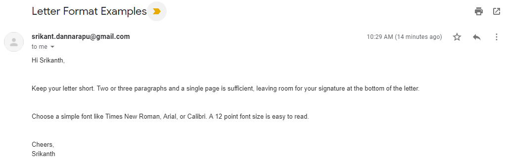

# springboot-quartz-mail

go to https://myaccount.google.com/security and set Less secure app access to ON

#postman Request

#postman Response

#email sent

#Overview of Quartz Scheduler’s APIs and Terminologies
#1. Scheduler
The Primary API for scheduling, unscheduling, adding, and removing Jobs.

#2. Job
The interface to be implemented by classes that represent a ‘job’ in Quartz. It has a single method called execute() where you write the work that needs to be performed by the Job.

#3. JobDetail
A JobDetail represents an instance of a Job. It also contains additional data in the form of a JobDataMap that is passed to the Job when it is executed.

Every JobDetail is identified by a JobKey that consists of a name and a group. The name must be unique within a group.

#4. Trigger
A Trigger, as the name suggests, defines the schedule at which a given Job will be executed. A Job can have many Triggers, but a Trigger can only be associated with one Job.

Every Trigger is identified by a TriggerKey that comprises of a name and a group. The name must be unique within a group.

Just like JobDetails, Triggers can also send parameters/data to the Job.

#5. JobBuilder
JobBuilder is a fluent builder-style API to construct JobDetail instances.

#6. TriggerBuilder
TriggerBuilder is used to instantiate Triggers.